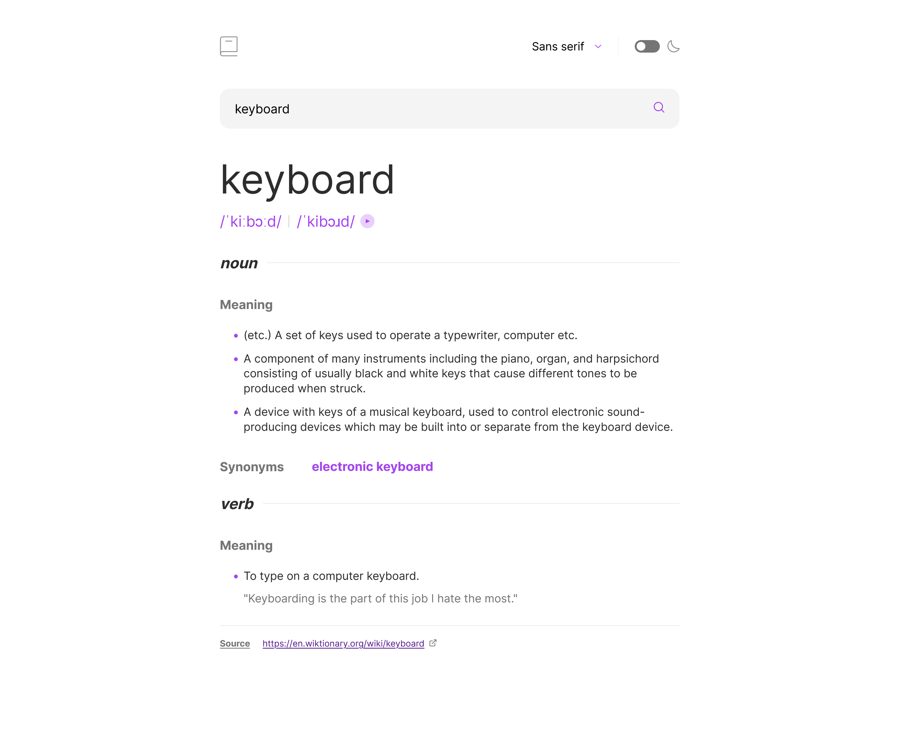

# Frontend Mentor - Dictionary web app solution

This is a solution to the [Dictionary web app challenge on Frontend Mentor](https://www.frontendmentor.io/challenges/dictionary-web-app-h5wwnyuKFL). Frontend Mentor challenges help you improve your coding skills by building realistic projects.

## Table of contents

-   [Overview](#overview)
    -   [The challenge](#the-challenge)
    -   [Screenshot](#screenshot)
    -   [Links](#links)
-   [My process](#my-process)
    -   [Built with](#built-with)
    -   [What I learned](#what-i-learned)
    -   [Continued development](#continued-development)
    -   [Useful resources](#useful-resources)
-   [Author](#author)

## Overview

### The challenge

Users should be able to:

-   Search for words using the input field
-   See the Free Dictionary API's response for the searched word
-   See a form validation message when trying to submit a blank form
-   Play the audio file for a word when it's available
-   Switch between serif, sans serif, and monospace fonts
-   Switch between light and dark themes
-   View the optimal layout for the interface depending on their device's screen size
-   See hover and focus states for all interactive elements on the page
-   **Bonus**: Have the correct color scheme chosen for them based on their computer preferences. _Hint_: Research `prefers-color-scheme` in CSS.

### Screenshot

### Links

-   Solution URL: [GitHub](https://github.com/Victoria-Sardelli/dictionary-web-app)
-   Live Site URL: [GitHub Pages](https://victoria-sardelli.github.io/dictionary-web-app/)

## My process

### Built with

-   Semantic HTML5 markup
-   CSS custom properties
-   Flexbox
-   CSS Grid
-   Mobile-first workflow

### What I learned

This project offered so many great challenges!
I learned how to:

-   Create a slider/toggle button
-   Switch between light and dark theme (and use the prefers-color-scheme system setting)
-   Utilize local storage
-   Send requests to third-party APIs and parse JSON responses
-   Work with promises using fetch and async/await (and how to handle errors)
-   Play audio
-   Dynamically generate HTML elements
-   Utilize and modify inline SVGs

### Continued development

This project really pushed me to explore how user preferences can be used to shape one's experience on a website. I would like to continue practicing ways in which I can respect and prioritize user preferences (e.g., checking system settings, storing user selections from previous sessions, etc.).

I would also like to continue learning about accessibility. I tried to keep accessibility in mind as I built out this project (e.g., ensuring that certain elements were reachable with the tab button, using aria labels, etc.), but I still feel like I've only scratched the surface.

From a JS perspective, I would also like to know more about best practices regarding code organization, especially when it comes to dividing code into seperate files and dynamically generating HTML code.

### Useful resources

-   [Building a theme switch component](https://web.dev/building-a-theme-switch-component/) - This was an insanely helpful guide on building a light/dark theme switch component. It even covered such topics as the page load experience, how to synchronize with system settings, how to utilize local storage to save the user's preferences, and more. To top it off, I was even able to apply a similar strategy (such as code organization, overall logical flow, local storage usage, etc.) when building out the font switcher component as well! I would highly recommend this tutorial.
-   [How to Detect a Click Outside an Element](https://www.w3docs.com/snippets/javascript/how-to-detect-a-click-outside-an-element.html) - This article provided helpful strategies to close the font switcher dropdown component when the user clicks outside of the element.

## Author

-   Frontend Mentor - [@Victoria-Sardelli](https://www.frontendmentor.io/profile/Victoria-Sardelli)
